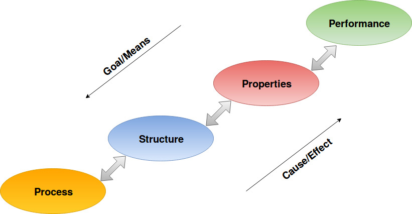
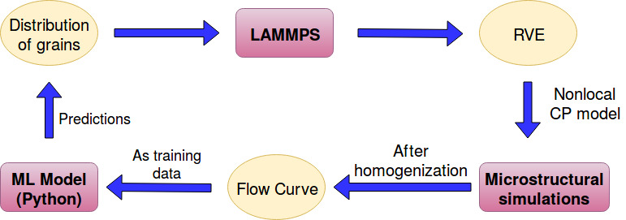
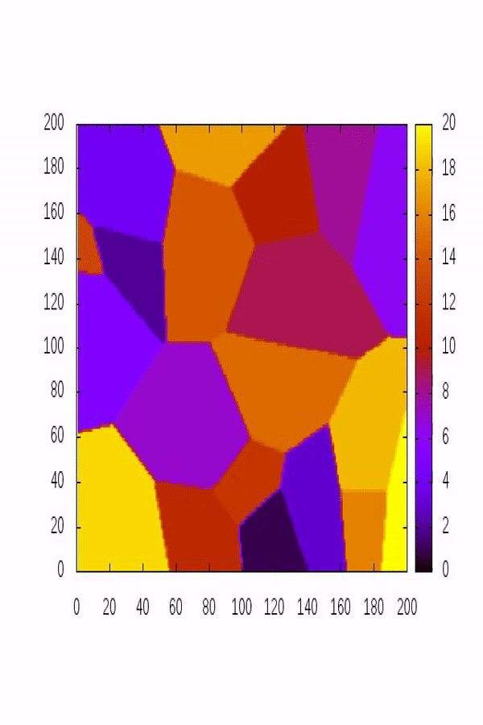
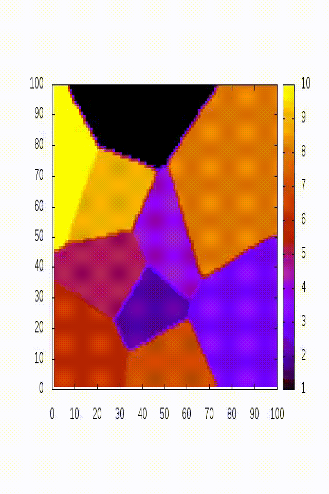
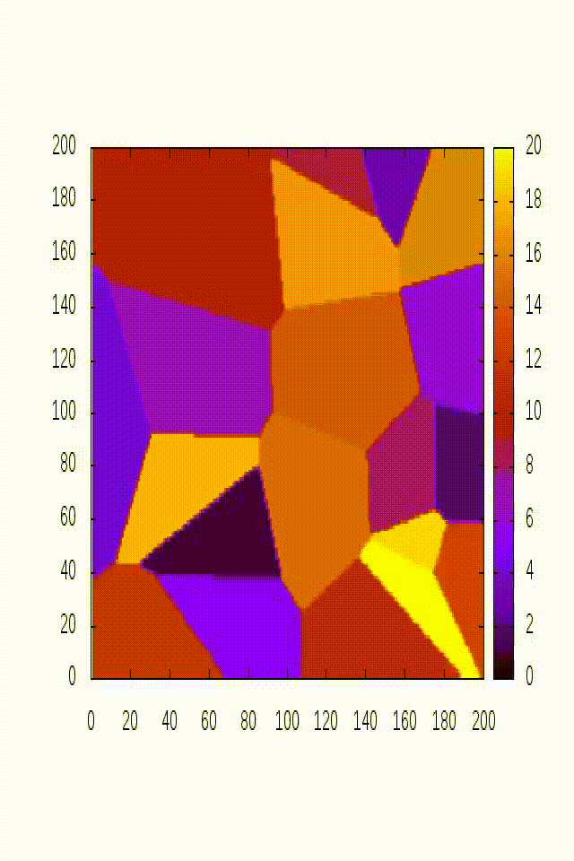
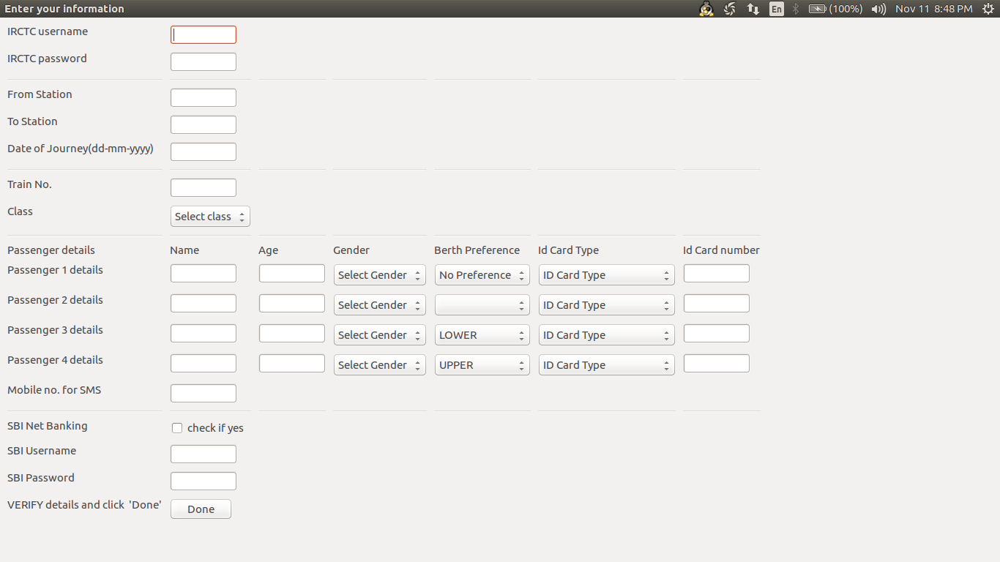

## Reasearch projects

### 1. Structure-Property linkages using Machine Learning
I was given an opportunity to work as a fully funded summer intern in [ICAMS](http://www.icams.de/content/) in [Prof. Alexander Hartmaier's](http://www.icams.de/content/people/icams-staff-members/?detail=5) group under the supervision of [Dr. Napat Vajragupta](http://www.icams.de/content/people/icams-staff-members/?detail=1385) during the summer of 2019.

Process-Structure-Property relationship is the crux of materials engineering. To design a material to try to meet a user's need. Based on the user's need we decide upon what properties the material should have (it can be strength, toughness, hydrogen resistance etc.) and then we try to figure  out which structure leads to the desired properties. The structure of the material is tuned by the processing technique used to manufacture the material. This is the inductive or the Goal/Means approach. The other way round is deductive or the Cause/Effect approach where we have a processing technique which decides the structure and that particular structure gives some properties and we try to find some applications for that material with those properties. Below is a schematic

In this project I have particularly focused on structure and property linkages. The ultimate goal of the project is to be able to construct the yield surface of a material by generating yield loci using robust machine learning models under different loading conditions. Before going to advanced analytical models like the Barlat YLD 2004-18p model I have attempted to replace relatively simpler crystal plasticity model called the nonlocal crystal plasticity model as given by [Anxin Ma and Alexander Hartmaier]. The output of the project would lead to a tool which can obviate the need to carry out time consuming and computationally expensive crystal plasticity finite element simulations. The motivation behind using machine learning algorithms comes because of the following reasons:

1. Only requires an initial investment of computational resources to train the model and once it is trained it is ready to be deployed and used.
2. Takes very less time to use it and is cost effective.
3. Machine learning models are very good at generalization and carefuly trained models also work well on new 'unseen' data points.

The below flow chart summarizes the steps involved in the project:

The project involves generation of training data to performing feature engineering and final development of machine learning pipeline to efficiently predict microstructural information from flow curve of the material. Good results were obtained in the project and I am 

### 2. Internship at Indian Institute of Sciences, Bengaluru

I was selected for [Summer Research Fellowship Programme (SRFP)](http://web-japps.ias.ac.in:8080/fellowship2017/lists/result.jsp), 2017 to work as a research intern in the materials engineering department of [Indian Institue of Science, Bengaluru](http://materials.iisc.ac.in/).

I worked under [Dr. Abhik Choudhury](http://materials.iisc.ac.in/faculty/abhik-choudhury/) on development of memory efficient phase field model based on the paper ["Computer simulations of two-dimensional and three-dimensional ideal grain growth"](Computer simulations of two-dimensional and three-dimensional ideal grain growth). The goal of the project was to make a develop an efficient implementation of a grain growth model such that it can comfortably run on a low end personal computer. I have made reusable package of my code so that people learning about phase field modeling can clone my [repository](https://github.com/nkc-137/Grain-Growth-Model) and play with it.

  
  
  

### 3. Numerical modeling in FORTRAN

Studying in materials science department and having an affinity towards mathematics & computing motivated me spend the summer of 2016 to learn more about numerical modeling by working on a project under [Dr. Kanjarla Anand Krishna](https://www.iitm.ac.in/info/fac/kanjarla) in my department. The final goal was to study stress induced diffusion in materials. I have implemented various equation solvers using finite difference and spectral methods. The code can be found in my [repository](https://github.com/nkc-137/Numerical-modeling-of-diffusion).

## Self Motivated Projects

### 1. Automated tatkal train tickets booking tool
For people with a slow computer or who are not that fast with using a computer often face the problem of not being able to book online tatkal train tickets (A system where online booking starts sharp at 11:00am and limited seats are given on a first book first serve basis). To solve this problem I have made a tool which can automatically book train tickets once the portal is open, all the user needs to do is enter his details and preferences in the code and run the code. The code will automiatically start the process at the right time. If you also want to book tatkal tickets faster than others feel free to use my [code](https://github.com/nkc-137/automation-tools).

[Anxin Ma and Alexander Hartmaier]: https://doi.org/10.1080/14786435.2013.847290
